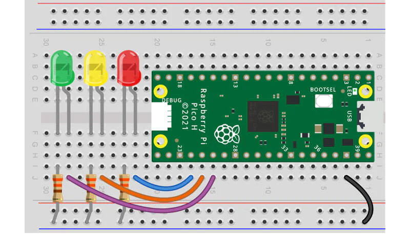
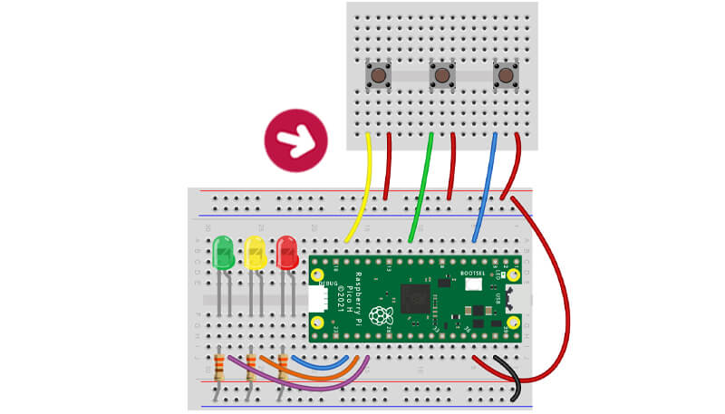
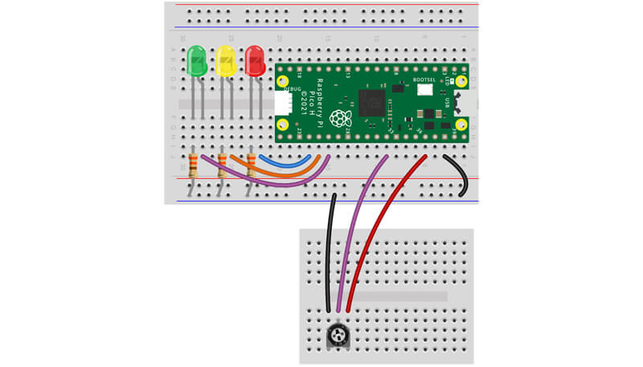

# The Pi Hut Advent

### Exploring the Raspberry Pi Pico with 12 Projects from The Pi Hut

This repo is for me to keep track of the projects I build with the components in the [the Pi Hut Advent Calendar](https://thepihut.com/pages/advent) and to have as a reference for myself.

I'll be following some of the projects in the guide but coming up with more challenging projects that use the components each day.

## Day 1 - Set up

### The [first day](https://thepihut.com/blogs/raspberry-pi-tutorials/maker-advent-calendar-day-1-getting-started) focuses on setting up and getting familiar with the Pico.

Pico Info:

- RP2040 microcontroller chip
- GPIO (General Purpose Input Output) pins
- [A map of Pico pins here](https://cdn.shopify.com/s/files/1/0176/3274/files/Pico-R3-A4-Pinout_f22e6644-b3e4-4997-a192-961c55fc8cae.pdf?v=1664490511)

### Software set up with [Thonny](https://thonny.org/).

The instructions here didn't work for me as there is a known issue with Mac. There's a [blog post](https://www.raspberrypi.com/news/the-ventura-problem/) from Raspberry Pi going into detail on this, but their suggested fixes didn't work for me. After some reading for potential fixes, I did the following, which ended up being closer to the actual Raspberry Pi docs:

- connected Pico to Mac holding the `BOOTSEL` button on the Pico
- A drive called `RP1-RP2` appears in the sidebar in finder
- Navigate to the [Raspberry Pi Docs for MicroPython](https://www.raspberrypi.com/documentation/microcontrollers/micropython.html). Or go through the Pico by:
  - Open the `RP1-RP2` drive
  - Open the `index.htm` file ([takes you here](https://www.raspberrypi.com/documentation/microcontrollers/))
  - Open the link to the Getting help with MicroPython
- Go to section on Drag and Drop MicroPython
- Download the correct MicroPython UF2 file for the Pico board
- Drag and drop the UF2 file from downloads to the `RP1-RP2` drive
- The file copies over and the Pico reboots
- Here you'll encounter the bug, a message is displayed saying `Disk Not Ejected Properly` - ignore it
- Disconnect/reconnect the USB **without** holding the `BOOTSEL` button - the drive should not appear in the sidebar
- Open a terminal and run this command `ls -ls /dev/cu.*`
- Listed you should see something like `/dev/cu.usb...` - showing the Pico is connected
- Open Thonny
- In the bottom right hand corner click on `Local Python 3 - Thonny Python`
- Select `MicroPython (Raspberry Pi Pico)` - you should see `/dev/cu.usb...` referenced after on the same line
- That should be it, try writing some code to run on the Pico!

Following on from this I did check the [day 1 instructions on the Pi Hut's website](https://thepihut.com/blogs/raspberry-pi-tutorials/maker-advent-calendar-day-1-getting-started) under 'Setting up Thonny' and did the following when the Pico was connected:

- Open Thonny and navigate to `Run > Configure Interpreter` in the menu bar
- Under `Port`, there's drop down which should have your Pico listed something like `Board in FS Mode (/dev/cu.usb...)`

### Setting up with VS Code

To do

---

## [Day 2](https://thepihut.com/blogs/raspberry-pi-tutorials/maker-advent-calendar-day-2-let-s-get-blinky) - LEDs



- 330 ohm resistors
- LEDs have a specific polarity, electricity can only flow in one direction. The long leg is the Anode (+) and the short leg is the Cathode (-). Current must always flow from the anode to the cathode.
- It doesn't matter which side of the LED the resistor sits, as long as it's there limiting the flow of current for the entire circuit

### Projects

- [Text to Morse code translator](https://github.com/olirooker/the-pi-hut-advent/blob/main/day2/03-morse-me.py) - Enter some text and it will be shown on the LEDs in Morse code.

---

## [Day 3](https://thepihut.com/blogs/raspberry-pi-tutorials/maker-advent-calendar-day-3-bashing-buttons) - Buttons



### Pull Downs

```python
# Using pull downs
Pin.PULL_DOWN
# Pass as an argument in Pin() function
redButton = Pin(3, Pin.IN, Pin.PULL_DOWN)
```

A button sends 3.3V to the GPIO pin to set it to `HIGH`. It needs to be `LOW` first or the code might not be able to detect a change / trigger randomly. A GPIO pin without a pull down can be 'floating' between 0V and 3.3V. Pulling down the pin to 0V ensures it always starts on `LOW`.

### Projects

- [LED Memory Game](https://github.com/olirooker/the-pi-hut-advent/blob/main/day3/03-led-memory-game.py) - Randomly generate a sequence of lights and using the buttons, enter the combination back to the Pico with three difficulty levels.

---

## [Day 4](https://thepihut.com/blogs/raspberry-pi-tutorials/maker-advent-calendar-day-4-amazing-analogue) - Analogue Inputs with a Potentiometer

- Digital inputs are strictly 1 and 0 (HIGH/LOW, ON/OFF). Analogue inputs have a wide range of numbers to represent values.
- The potentiometer can pass these analogue signals in the form of voltage to the Pico.
- A potentiometer is a variable resistor.
- The potentiometer here is a 10K potentiometer, it can be set anywhere from 0 ohms to 10,000 ohms (resistance is measured in ohms).

### Circuit



### ADC Pins (Analogue to Digital Converter)

- An ADC is an Analogue to Digital Converter. The ADC pins on our Pico have the special ability of being able to convert an analogue input into a digital form we can use. We have to import ADC in our code to use this feature.
- `from machine import ADC` to use.
- GPIO26, 27 and 28 (physical pins 31,32 and 34) - [a map of Pico pins here](https://cdn.shopify.com/s/files/1/0176/3274/files/Pico-R3-A4-Pinout_f22e6644-b3e4-4997-a192-961c55fc8cae.pdf?v=1664490511).
- The Pico's ADC pins are 12-bit, however MicroPython scales this to a 16-bit range which is 0-65535.
- Invoke `.read_u16()` to scale to 16-bit.

### PWM (Pulse Width Modulation)

- A type of digital signal where we, over a set period of time, decide how long the signal is ON (HIGH) and how long it's OFF (LOW).
- This can create a fading effect for LEDs but also is used for things like servos.
- Our code needs some values from us to enable it to run PWM for us - `Duty Cycle` and `Frequency`.
- The `duty cycle` is the percentage of the time that our LED will be ON. The higher the `duty cycle`, the longer the LED will be ON, and the brighter our LED will appear.
- `Duty cycle` for the Pico in MicroPython can range from 0 to 65535, which matches the output of the potentiometer (0-65535) so we can use this value directly without having to manipulate it.
- `Frequency` is the number of times per second that we will repeat the ON/OFF cycle.

### Projects

- Testing effects using PWN programmatically rather than with the potentiometer.
- [Pule LEDs]()
- [Fade LEDs]()

## [Day 5]() - Sound
